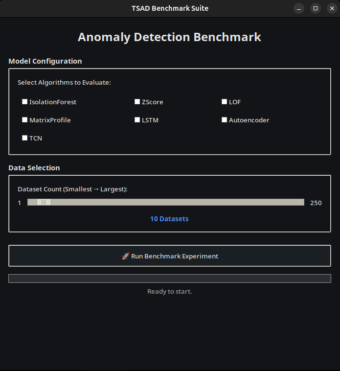

# TSAD Benchmark Suite

**A unified framework for Time Series Anomaly Detection (TSAD) research.**

This project enables the systematic evaluation of anomaly detection algorithms on time-series data. It bridges the gap between classic statistical methods and modern deep learning architectures, offering a standardized pipeline to train, test, and rank detectors.

## Dataset

This benchmark utilizes the **Hexagon ML/UCR Time Series Anomaly Detection dataset**.

[Download the dataset here](https://www.cs.ucr.edu/~eamonn/time_series_data_2018/UCR_TimeSeriesAnomalyDatasets2021.zip).

## Quickstart

1. **Clone the repository:**

   ```bash
   git clone https://github.com/kabu03/tsad-benchmark
   cd tsad-benchmark
   ```

2. **Install dependencies:**

   ```bash
   pip install -r requirements.txt
   ```

3. **Run the program:**

Either run the GUI:
   ```bash
   python3 src/gui.py
   ```
Or use the CLI to run specific experiments. Examples:

   ```bash
   python3 -m src.benchmark --group deep # runs all deep learning models
   python3 -m src.benchmark --models LSTM --num_datasets 50 # runs LSTM on the 50 smallest datasets
   ```

## Models Included

The suite covers the following detectors:

| Category          | Models                                                                                       |
| ----------------- | -------------------------------------------------------------------------------------------- |
| **Traditional**   | • Isolation Forest<br>• Z-Score<br>• Local Outlier Factor (LOF)<br>• Matrix Profile Discords |
| **Deep Learning** | • Long Short-Term Memory (LSTM)<br>• Autoencoder<br>• Temporal Convolutional Network (TCN)   |

## Performance Metrics

Models are evaluated using rigorous ranking and classification metrics:

- **AUC-ROC** (Area Under the ROC Curve)
- **PR-AUC** (Area Under the Precision-Recall Curve)
- **Top-K Hit Rate** (Oracle Top-K accuracy)


## MLflow Experiment Tracking

The benchmark automatically logs all experiments with MLflow. To visualize the metrics and compare the models:

1) Start the MLflow UI: `mlflow ui`
2) Open `http://127.0.0.1:5000`.

Metrics are also automatically saved as JSON files in the `results/` directory.

## Docker Support

You can run the program in an isolated container.

### 1. Build the image

```bash
docker build -t tsad-bench .
```

### 2. Run the GUI (Default)

To view the GUI from within the container, you must share your X11 display.

**Linux Users:**

```bash
docker run --rm \
  -e DISPLAY=$DISPLAY \
  -v /tmp/.X11-unix:/tmp/.X11-unix \
  -v $(pwd)/results:/app/results \
  -v $(pwd)/mlruns:/app/mlruns \
  tsad-bench
```

_(Note: If you encounter permission errors, run `xhost +local:docker` on your host machine before running the container.)_

Optionally, you can bypass the GUI and run the command-line benchmark directly, by overriding the entrypoint:

```bash
docker run --rm \
  -v $(pwd)/results:/app/results \
  -v $(pwd)/mlruns:/app/mlruns \
  --entrypoint python \
  tsad-bench -m src.benchmark --group deep
```

## GUI Preview



## Contributions

Contributions are welcome! Please open an issue or pull request with a clear problem statement and reproducible steps.
